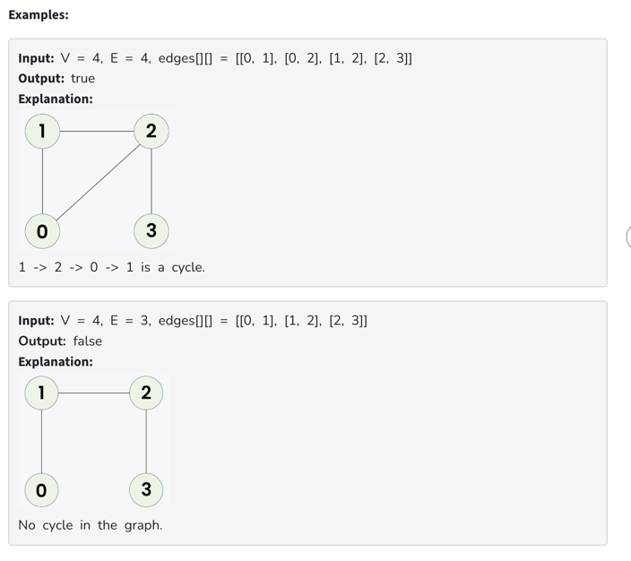

https://www.geeksforgeeks.org/problems/detect-cycle-in-an-undirected-graph/1

Given an undirected graph with V vertices and E edges, represented as a 2D vector edges[][], where each entry edges[i] = [u, v] denotes an edge between vertices u and v, determine whether the graph contains a cycle or not.

Note: The graph can have multiple component.

Constraints:
1 ≤ V, E ≤ 105
0 ≤ edges[i][0], edges[i][1] < V

