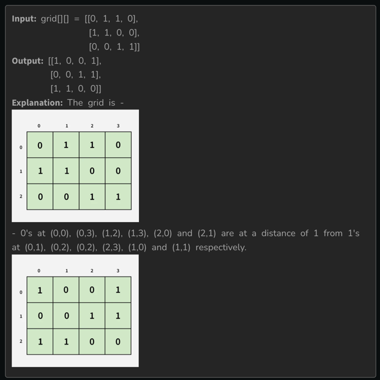
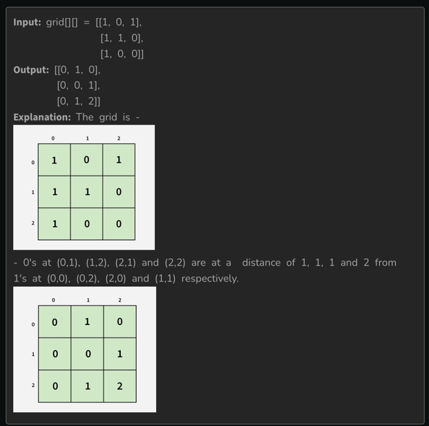

https://www.geeksforgeeks.org/problems/distance-of-nearest-cell-having-1-1587115620/1

Given a binary grid[][], where each cell contains either 0 or 1, find the distance of the nearest 1 for every cell in the grid.
The distance between two cells (i1, j1)  and (i2, j2) is calculated as |i1 - i2| + |j1 - j2|.
You need to return a matrix of the same size, where each cell (i, j) contains the minimum distance from grid[i][j] to the nearest cell having value 1.

Note: It is guaranteed that there is at least one cell with value 1 in the grid.

Examples

